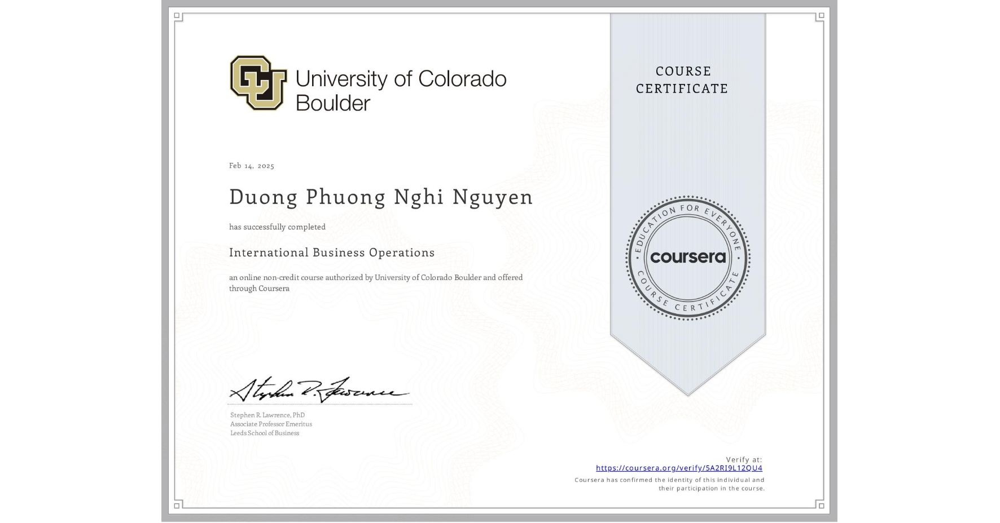

<table style="width: 90%; text-align: center; margin-left: auto; margin-right: auto;">
<tr>
    <td style="padding: 15px; text-align: center;">
        
</tr>
    <tr>
        <td style="text-align: center;">
            <a href="https://www.coursera.org/account/accomplishments/verify/5A2RI9L12QU4" target="_blank" style="text-decoration: none; color: inherit;">
                <strong>International Business Operations</strong> University of Colorado Boulder
            </a>
        </td>
    </tr>
</table>
