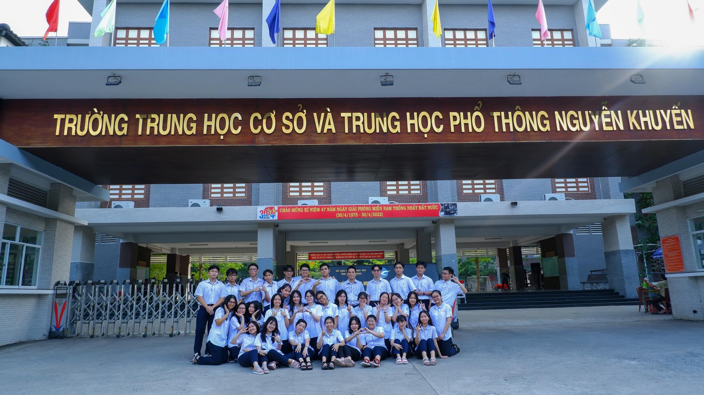
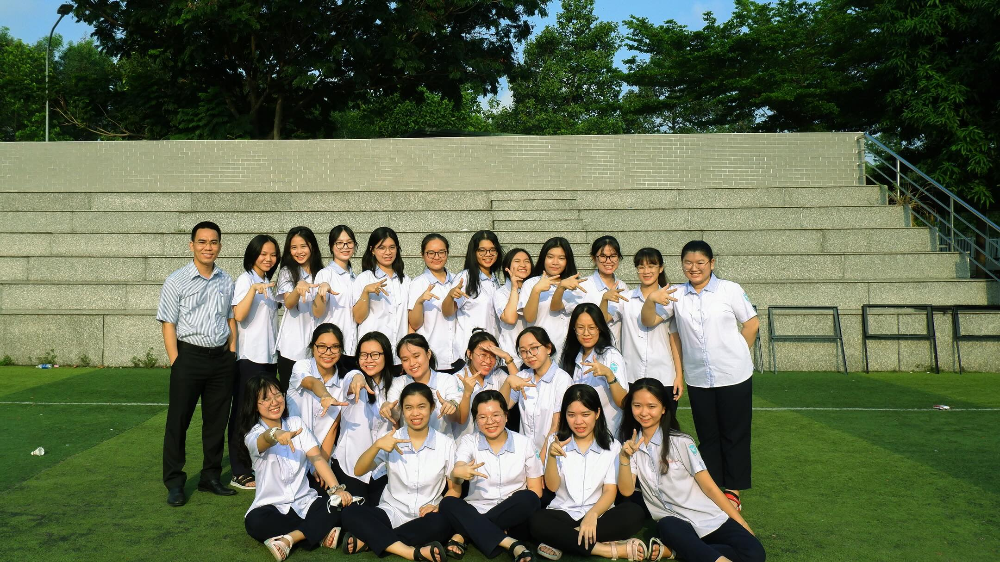




Gained admission to UEL with 26,3 grade in National High School exam
Skills: 
<ul>
  <li>Accounting</li>
  <li>Microsoft Office</li>
  <li>SAP Materials Management (SAP MM)</li>
  <li>SAP Sales & Distribution</li>
  <li> SAP ERP </li>
</ul>




Gained admission to UEL with 26,3 grade in National High School exam
Skills: 
<ul>
  <li>Cross-functional Team Leadership</li>
  <li>Multinational Team Management</li>
  <li>Flexible Approach</li>
  <li>Easily Adaptable</li>
</ul>

  
  




Skills: 
<ul>
  <li>In endlish advanced class   </li>
  <li>Achieved 7.0 IELTS</li>
</ul>


  
  
  



